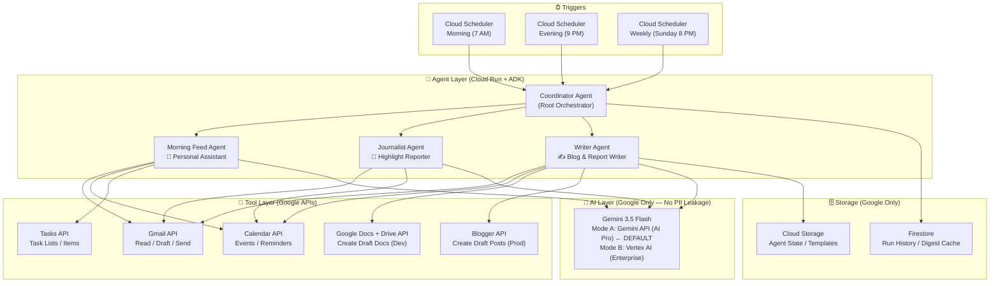
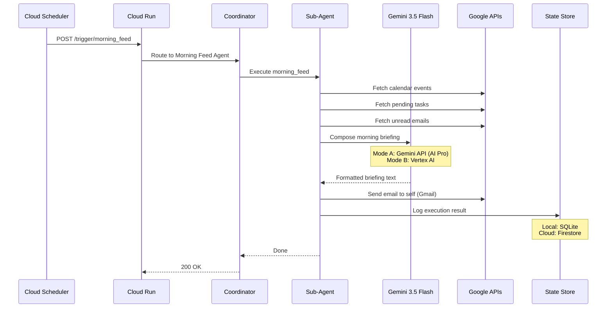

# Personal Assistant Agent System — Google Stack

A privacy-first, multi-agent system built entirely within Google's ecosystem that acts as your **Personal Assistant**, **Journalist**, and **Writer** — powered by Gemini and Google ADK.

---

## Architecture Overview



---

## AI Backend Modes

The system supports **two interchangeable AI backends** — both keep all data within Google's infrastructure. Switch between them with a single environment variable.

### Mode A: Gemini API — AI Pro Subscription ⭐ DEFAULT

> [!TIP]
> **Zero additional AI cost** — Uses your existing Google AI Pro subscription. Simplest setup, perfect for personal use.

```env
# .env configuration for Mode A
GOOGLE_GENAI_USE_VERTEXAI=FALSE
GOOGLE_API_KEY=your-gemini-api-key-from-aistudio
```

| Aspect | Detail |
|---|---|
| **Model** | Gemini 3.5 Flash via Gemini API (`generativelanguage.googleapis.com`) |
| **Cost** | **$0** — included in your AI Pro subscription |
| **Data training** | Opt-out via Google Account → Data & Privacy → Gemini Apps Activity → **OFF** |
| **Auth** | Simple API key from [AI Studio](https://aistudio.google.com/app/apikey) |
| **PII boundary** | ✅ All data stays within Google's infrastructure |
| **Best for** | Personal use, development, prototyping |

### Mode B: Vertex AI — Enterprise Tier (Optional Upgrade)

> [!NOTE]
> **Contractual privacy guarantee** — For production workloads or if you need legal/compliance assurances that your data is never used for training.

```env
# .env configuration for Mode B
GOOGLE_GENAI_USE_VERTEXAI=TRUE
GOOGLE_CLOUD_PROJECT=your-gcp-project-id
GOOGLE_CLOUD_LOCATION=us-central1
```

| Aspect | Detail |
|---|---|
| **Model** | Gemini 3.5 Flash via Vertex AI (`aiplatform.googleapis.com`) |
| **Cost** | ~$0.15/1M input tokens, ~$0.60/1M output tokens (Flash) |
| **Data training** | **Never** — contractual Cloud Data Processing Addendum |
| **Auth** | Service Account / Application Default Credentials |
| **PII boundary** | ✅ VPC Service Controls + audit logs |
| **Best for** | Enterprise, compliance-sensitive, production hardened |

### Side-by-Side Comparison

| | Mode A: Gemini API (AI Pro) | Mode B: Vertex AI |
|---|---|---|
| **Setup complexity** | 🟢 Simple (1 API key) | 🟡 Moderate (GCP project + IAM) |
| **AI cost** | 🟢 $0 (included in subscription) | 🟡 Pay-per-use (~$1-2/month) |
| **No-training guarantee** | 🟡 Opt-out setting | 🟢 Contractual |
| **VPC isolation** | ❌ Not available | 🟢 Full VPC Service Controls |
| **Audit logging** | ❌ Basic | 🟢 Cloud Audit Logs |
| **Rate limits** | AI Pro tier limits | GCP project quotas |
| **ADK config** | `GOOGLE_GENAI_USE_VERTEXAI=FALSE` | `GOOGLE_GENAI_USE_VERTEXAI=TRUE` |

---

## Privacy Architecture

> [!IMPORTANT]
> **Zero PII Leakage Guarantee** — All data processing happens within Google's infrastructure. In **Mode A**, disable "Gemini Apps Activity" to prevent training. In **Mode B**, Google contractually guarantees no training. Either way, **no data is ever sent to non-Google AI platforms**.

| Concern | Solution |
|---|---|
| AI Model | Gemini 3.5 Flash — **Mode A**: Gemini API (AI Pro) / **Mode B**: Vertex AI |
| Data Transit | All API calls stay within Google's network |
| Authentication | **OAuth 2.0** for personal Google account access (Gmail, Calendar, Tasks) |
| Secrets | `.env` file locally / **Google Secret Manager** in production |
| Compute | Local Python (dev) / **Cloud Run** (prod — within your GCP project) |
| Storage | Local SQLite (dev) / **Firestore** + **Cloud Storage** (prod) |
| Blog Output | **Google Blogger** (stays in Google ecosystem) |
| Notifications | **Gmail API** send-as-self (email to yourself) |

---

## Confirmed Design Decisions

> [!TIP]
> **Cost Estimate**: Using Mode A (AI Pro), the only cost is your existing subscription. Cloud Run + Firestore adds **< $2/month** for scheduling in production. Total: **$0 for local dev**, **< $2/month for cloud deployment**.

| Decision | Choice |
|---|---|
| 📍 **Photos location data** | Download photos via API → extract **EXIF GPS data** locally |
| 📝 **Blog platform** | **Google Docs** (dev/personal) + **Blogger** (production) — both as **drafts only** |
| ⏰ **Schedule (AEST)** | 7:00 AM morning feed · 9:00 PM evening digest · Sunday 8:00 PM weekly report |
| 📧 **Notifications** | **Email to self** via Gmail API |
| 👁️ **Blog visibility** | **Draft-only** (private review before publishing) |
| 📸 **Photos scope** | **All daily photos** (no album filter) |

> [!NOTE]
> **Google Photos API Limitation**: The Photos Library API does not expose GPS/location metadata directly. The system will download each photo and extract GPS coordinates from embedded EXIF data using the `exifread` Python library. Photos without EXIF GPS will be described by Gemini Vision without location context.

---

## Proposed Changes

### Project Structure

```
PersonalAssistantAgentSystem-GoogleStack/
├── README.md
├── pyproject.toml                    # Python project config (uv/pip)
├── Dockerfile                        # Cloud Run container
├── cloudbuild.yaml                   # CI/CD pipeline
├── deploy/
│   ├── terraform/                    # Infrastructure as Code
│   │   ├── main.tf
│   │   ├── variables.tf
│   │   ├── cloud_run.tf
│   │   ├── scheduler.tf
│   │   ├── iam.tf
│   │   └── secrets.tf
│   └── scheduler-payloads/
│       ├── morning_feed.json
│       ├── evening_digest.json
│       └── weekly_report.json
├── src/
│   ├── __init__.py
│   ├── main.py                       # Cloud Run entrypoint (FastAPI)
│   ├── config.py                     # Environment & secrets config
│   ├── agents/
│   │   ├── __init__.py
│   │   ├── coordinator.py            # Root orchestrator agent
│   │   ├── morning_feed.py           # Morning assistant agent
│   │   ├── journalist.py             # Highlight reporter agent
│   │   └── writer.py                 # Blog/report writer agent
│   ├── tools/
│   │   ├── __init__.py
│   │   ├── gmail_tool.py             # Gmail read/send operations
│   │   ├── calendar_tool.py          # Calendar events reader
│   │   ├── tasks_tool.py             # Google Tasks reader
│   │   │   ├── docs_tool.py              # Google Docs creation (dev/personal mode)
│   │   └── blogger_tool.py           # Blogger post creation (production mode)
│   ├── services/
│   │   ├── __init__.py
│   │   ├── auth.py                   # OAuth2 token management
│   │   ├── state.py                  # Firestore state management
│   │   └── templates.py             # Email/blog HTML templates
│   └── prompts/
│       ├── morning_feed.txt          # Morning feed system prompt
│       ├── journalist.txt            # Journalist system prompt
│       ├── writer_daily.txt          # Daily blog system prompt
│       └── writer_weekly.txt         # Weekly report system prompt
├── templates/
│   ├── morning_email.html            # Morning feed email template
│   ├── highlight_email.html          # Journalist highlight template
│   ├── daily_blog.html               # Daily blog post template
│   └── weekly_report.html            # Weekly report template
├── tests/
│   ├── __init__.py
│   ├── test_tools/
│   ├── test_agents/
│   └── test_integration/
├── scripts/
│   ├── setup_oauth.py                # One-time OAuth flow
│   └── test_local.py                 # Local agent testing
└── .env.example                      # Environment variable template
```

---

### Component 1: Core Infrastructure

#### [NEW] [pyproject.toml]

Python project configuration with dependencies:
- `google-adk` — Agent Development Kit (works with both Gemini API and Vertex AI)
- `google-genai` — Google Gen AI SDK (unified client for both AI modes)
- `google-api-python-client` — Gmail, Calendar, Tasks, Photos, Blogger APIs
- `google-auth-oauthlib` — OAuth 2.0 authentication
- `google-cloud-firestore` — State persistence (prod mode)
- `google-cloud-storage` — Template & asset storage (prod mode)
- `google-cloud-secret-manager` — Secrets management (prod mode)
- `fastapi` + `uvicorn` — Cloud Run HTTP server
- `jinja2` — HTML templating
- `exifread` — Photo EXIF/GPS extraction
- `python-dotenv` — Environment variable loading (.env file support)

#### [NEW] [Dockerfile]
Slim Python 3.12 container for Cloud Run deployment.

#### [NEW] [src/config.py]

Centralized configuration with AI mode detection:

```python
# Auto-detects which AI backend to use based on env vars
class Config:
    # AI Mode
    use_vertex_ai: bool = os.getenv("GOOGLE_GENAI_USE_VERTEXAI", "FALSE") == "TRUE"
    gemini_api_key: str = os.getenv("GOOGLE_API_KEY", "")        # Mode A
    gcp_project: str = os.getenv("GOOGLE_CLOUD_PROJECT", "")     # Mode B
    gcp_location: str = os.getenv("GOOGLE_CLOUD_LOCATION", "")   # Mode B
    
    # Model selection (same model name works for both modes)
    model_name: str = "gemini-3.5-flash"
```

#### [NEW] [.env.example]

```env
# ============================================
# AI BACKEND MODE (choose one)
# ============================================

# --- Mode A: Gemini API (AI Pro subscription) --- DEFAULT
GOOGLE_GENAI_USE_VERTEXAI=FALSE
GOOGLE_API_KEY=your-api-key-from-aistudio.google.com

# ============================================
# BLOG BACKEND (choose one)
# ============================================
BLOG_BACKEND=docs  # "docs" for Google Docs (dev/personal), "blogger" for production

# --- Mode B: Vertex AI (uncomment to switch) ---
# GOOGLE_GENAI_USE_VERTEXAI=TRUE
# GOOGLE_CLOUD_PROJECT=your-gcp-project-id
# GOOGLE_CLOUD_LOCATION=us-central1

# ============================================
# GOOGLE WORKSPACE OAUTH
# ============================================
OAUTH_CLIENT_SECRETS_FILE=credentials/client_secrets.json
OAUTH_TOKEN_FILE=credentials/token.json

# ============================================
# GOOGLE DOCS (dev/personal blog backend)
# ============================================
GOOGLE_DOCS_OUTPUT_FOLDER_ID=your-drive-folder-id-for-blog-drafts

# ============================================
# BLOGGER (production blog backend)
# ============================================
BLOGGER_BLOG_ID=your-blogger-blog-id

# ============================================
# SCHEDULE (AEST / UTC+10)
# ============================================
MORNING_FEED_HOUR=7
EVENING_DIGEST_HOUR=21
WEEKLY_REPORT_DAY=sunday
TIMEZONE=Australia/Brisbane
```

---

### Component 2: Authentication & Services

#### [NEW] [src/services/auth.py]

OAuth 2.0 credential management:
- **Local dev**: Loads tokens from `credentials/token.json` (created by one-time OAuth flow)
- **Production**: Loads stored OAuth tokens from Secret Manager
- Refreshes expired tokens automatically
- Scopes: Gmail (read/send), Calendar (read), Tasks (read), Blogger (write)

#### [NEW] [src/services/state.py]

State management with dual backends:
- **Local dev**: SQLite file (`data/agent_state.db`) — zero setup
- **Production**: Firestore — scalable, serverless
- Tracks last-processed email/event IDs (deduplication)
- Stores daily digest summaries for weekly rollup

---

### Component 3: Google API Tools (ADK-Compatible)

Each tool is implemented as an ADK-compatible `FunctionTool` that the agents can invoke.

#### [NEW] [src/tools/gmail_tool.py]

| Function | Description |
|---|---|
| `get_unread_emails(max_results, since)` | Fetch unread **personal/work** emails (auto-filters noise) |
| `get_important_emails(since)` | Fetch starred/important emails |
| `send_email(to, subject, html_body)` | Send HTML email (for self-notifications) |
| `search_emails(query, max_results)` | Search emails by Gmail query syntax |

**Built-in Email Noise Filter** — The `get_unread_emails` function automatically excludes:

| Excluded Category | Gmail Query Filter |
|---|---|
| Newsletters & subscriptions | `-category:promotions -category:updates -label:newsletter` |
| Marketing / Ads | `-category:promotions` |
| Bulk / mailing lists | `-list:*` (list-unsubscribe header detection) |
| Common noise senders | Configurable skip-list in `config.py` |

```python
# Core Gmail query used by get_unread_emails()
NOISE_FILTER_QUERY = (
    "is:unread "
    "-category:promotions "
    "-category:social "
    "-category:updates "
    "-category:forums "
    "-{unsubscribe} "          # Emails with unsubscribe links
    "-from:noreply@* "
    "-from:newsletter@* "
    "-from:marketing@* "
    "-from:digest@* "
)

# Additional configurable skip-list (in config.py)
EMAIL_SKIP_SENDERS = [
    "*@substack.com",
    "*@medium.com",
    "*@mailchimp.com",
    "*@sendgrid.net",
    # Add your own noise senders here
]
```

> [!NOTE]
> **Future Enhancement**: You mentioned planning a separate **Email Auto-Label/Grouping** application for newsletter management, email summarization, and cleanup. This agent system intentionally does NOT manage those categories — it simply skips them. The two systems are designed to complement each other:
> - **This system** → Personal assistant (reads only actionable/personal emails)
> - **Future system** → Email manager (labels, groups, summarizes, and cleans up the rest)

#### [NEW] [src/tools/calendar_tool.py]

| Function | Description |
|---|---|
| `get_today_events()` | All events for today with times, locations, descriptions |
| `get_upcoming_events(days)` | Events for the next N days |
| `get_reminders()` | Payment reminders and recurring events |

#### [NEW] [src/tools/tasks_tool.py]

| Function | Description |
|---|---|
| `get_pending_tasks()` | All incomplete tasks across all task lists |
| `get_due_today()` | Tasks due today |
| `get_overdue_tasks()` | Overdue tasks requiring attention |


#### [NEW] [src/tools/docs_tool.py]

Google Docs blog creation (dev/personal mode) — uses the **Drive API** HTML-to-Docs conversion for rich formatting:

| Function | Description |
|---|---|
| `create_blog_doc(title, html_content, folder_id)` | Create a Google Doc from HTML content in a specified Drive folder |
| `insert_image_to_doc(doc_id, image_url, index)` | Insert a photo into an existing Doc |
| `list_blog_docs(folder_id)` | List all blog docs in the output folder |

> [!TIP]
> The **HTML-to-Docs conversion** method (uploading HTML via Drive API with MIME type `application/vnd.google-apps.document`) is used instead of raw `batchUpdate` index manipulation. This is simpler, more reliable, and handles headings, bold, images, and formatting automatically.

#### [NEW] [src/tools/blogger_tool.py]

Blogger post creation (production mode) — all posts created as **drafts** for your review:

| Function | Description |
|---|---|
| `create_draft_post(title, html_content, labels)` | Create a Blogger post as draft (never auto-publishes) |
| `embed_photo_in_post(photo_url)` | Generate HTML img tag for photo embedding |

---

### Component 4: Agent Definitions (ADK)

#### [NEW] [src/agents/coordinator.py]

**Root Orchestrator** — Receives triggers from Cloud Scheduler and delegates to the appropriate sub-agent based on the trigger type:

```python
# Pseudocode structure
from google.adk.agents import Agent, SequentialAgent

coordinator = Agent(
    name="coordinator",
    model="gemini-3.5-flash",
    description="Routes scheduled triggers to the appropriate sub-agent",
    sub_agents=[morning_feed_agent, journalist_agent, writer_agent],
)
```

**Trigger routing:**
| Trigger | Agent | Action |
|---|---|---|
| `morning_feed` | Morning Feed Agent | Compile & send morning briefing |
| `evening_digest` | Journalist Agent → Writer Agent | Generate highlights → Write daily blog |
| `weekly_report` | Writer Agent | Compile weekly activity report |

#### [NEW] [src/agents/morning_feed.py]

**🌅 Morning Feed Agent** — Your personal assistant for the day ahead.

**Workflow:**
1. Fetch today's calendar events (meetings, reminders, payments due)
2. Fetch pending and overdue tasks
3. Fetch unread/important emails — **filtered** (skips newsletters, blogs, ads, webinars)
4. Use Gemini to compose a personalized morning briefing
5. Send HTML email to yourself via Gmail API

**Output format** (email to self):
```
☀️ Good Morning! Here's your day — Tuesday, May 13

📅 TODAY'S SCHEDULE
• 9:00 AM — Team standup (Google Meet)
• 2:00 PM — Dentist appointment
• 💰 Payment due: Electricity bill ($85)

📋 TASKS TO TACKLE
• Finish quarterly report (due today!)
• Review PR #342 (overdue by 2 days)

📧 EMAIL HIGHLIGHTS (overnight)
• From boss@company.com: "Q2 Planning" — New budget proposal attached
• From bank@example.com: Statement ready for download

💡 TIP: You have a 3-hour gap between standup and dentist — perfect for the quarterly report!
```

#### [NEW] [src/agents/journalist.py]

**📰 Journalist Agent** — Reports highlights from your digital life.

**Workflow:**
1. Scan today's **personal/work emails** for notable threads (skips newsletters, blogs, ads, webinars)
2. Review calendar events that occurred today
4. Use Gemini to identify the "top stories" of your day
5. Send HTML highlight report to yourself

**Output format** (email to self):
```
📰 Your Daily Highlights — Tuesday, May 13

🔥 TOP STORY
Your team approved the Q2 budget with a 15% increase!

📸 PHOTO MOMENTS
• 12:30 PM — Lunch at Darling Harbour (3 photos)
  "A vibrant waterfront scene with boats and city skyline..."
• 5:45 PM — Sunset from the office (1 photo)

📧 NOTABLE EMAILS
• Project X contract signed — forwarded from legal@company.com
• New feature request from client ABC

📅 COMPLETED EVENTS
• ✅ Team standup — discussed sprint goals
• ✅ Dentist appointment — checkup complete
```

#### [NEW] [src/agents/writer.py]

**✍️ Writer Agent** — Creates blog posts and weekly activity reports.

**Daily Blog Workflow:**
1. Receive highlight data from Journalist Agent (or re-query APIs)
4. Use Gemini to write a personal, narrative-style blog post
3. Embed location context into the narrative (if provided manually)
6. Create as **draft** — Google Docs (dev) or Blogger (prod)

**Weekly Report Workflow:**
1. Query state store for the past 7 days of daily digests
2. Aggregate calendar events, tasks completed, key emails
3. Use Gemini to produce a structured weekly activity report
4. Create as **draft** — Google Docs (dev) or Blogger (prod) with "Weekly Report" label

**Blog Backend Selection:**
```python
# Automatically uses the right backend based on config
if config.blog_backend == "docs":    # Dev/Personal
    docs_tool.create_blog_doc(title, html, folder_id)
else:                                  # Production
    blogger_tool.create_draft_post(title, html, labels)
```

---

### Component 5: API Server & Scheduling

#### [NEW] [src/main.py]

FastAPI application serving as the Cloud Run entrypoint:

```python
@app.post("/trigger/{agent_type}")
async def trigger_agent(agent_type: str):
    """Endpoint called by Cloud Scheduler"""
    # agent_type: "morning_feed" | "evening_digest" | "weekly_report"
    result = await coordinator.run(trigger=agent_type)
    return {"status": "ok", "result": result}
```

#### [NEW] Cloud Scheduler Jobs (via Terraform)

| Job Name | Schedule (AEST) | Target | Payload |
|---|---|---|---|
| `morning-feed` | `0 7 * * *` (7 AM daily) | `/trigger/morning_feed` | `{"type": "morning_feed"}` |
| `evening-digest` | `0 21 * * *` (9 PM daily) | `/trigger/evening_digest` | `{"type": "evening_digest"}` |
| `weekly-report` | `0 20 * * 0` (8 PM Sunday) | `/trigger/weekly_report` | `{"type": "weekly_report"}` |

---

### Component 6: HTML Templates

#### [NEW] templates/ directory

Beautiful, responsive HTML email templates using inline CSS (for Gmail compatibility):
- `morning_email.html` — Clean, card-based layout with emoji headers
- `highlight_email.html` — Magazine-style highlight report
- `daily_blog.html` — Photo-rich blog post template
- `weekly_report.html` — Dashboard-style weekly summary with stats

---

### Component 7: Infrastructure (Terraform)

#### [NEW] deploy/terraform/

| File | Resources |
|---|---|
| `main.tf` | Provider config, project setup |
| `cloud_run.tf` | Cloud Run service for the agent system |
| `scheduler.tf` | 3 Cloud Scheduler jobs (morning, evening, weekly) |
| `iam.tf` | Service accounts, IAM roles |
| `secrets.tf` | Secret Manager for OAuth tokens |
| `firestore.tf` | Firestore database for state |
| `storage.tf` | Cloud Storage bucket for templates/assets |

---

## Implementation Phases

### Phase 0: Quick Prototype — Apps Script Morning Feed ⚡ (1-2 hours)

> [!TIP]
> **Get value on day 1.** Before building the full ADK system, deploy a working morning briefing email using Google Apps Script. Zero cost, zero infrastructure, and you'll have a real morning feed in your inbox tomorrow at 7 AM.

**What you get:** A daily 7 AM email with your calendar events, pending tasks, and a Gemini-composed briefing.

**What you don't get (yet):** Email highlights, photo analysis, blog writing — those come in the full system.

#### Setup Steps

1. Go to [script.google.com](https://script.google.com) → New Project
2. Name it `PersonalAssistant-MorningFeed`
3. Paste the code below
4. Add your Gemini API key
5. Set a time-driven trigger for 7:00 AM
6. Done ✅

#### [NEW] [prototype/morning_feed.gs]

```javascript
// ============================================
// Personal Assistant — Morning Feed Prototype
// Google Apps Script + Gemini API
// ============================================

const GEMINI_API_KEY = 'YOUR_GEMINI_API_KEY'; // From aistudio.google.com
const MY_EMAIL = Session.getActiveUser().getEmail();
const TIMEZONE = 'Australia/Brisbane';

function morningFeed() {
  const today = new Date();
  const todayStr = Utilities.formatDate(today, TIMEZONE, 'EEEE, MMMM d, yyyy');
  
  // 1. Fetch Calendar Events
  const events = getCalendarEvents(today);
  
  // 2. Fetch Tasks
  const tasks = getPendingTasks();
  
  // 3. Compose briefing with Gemini
  const briefing = composeBriefing(todayStr, events, tasks);
  
  // 4. Send email to self
  sendMorningEmail(todayStr, briefing);
}

function getCalendarEvents(date) {
  const calendars = CalendarApp.getAllCalendars();
  const endOfDay = new Date(date);
  endOfDay.setHours(23, 59, 59);
  
  let eventList = [];
  calendars.forEach(cal => {
    cal.getEventsForDay(date).forEach(event => {
      const isAllDay = event.isAllDayEvent();
      const time = isAllDay 
        ? 'All Day' 
        : Utilities.formatDate(event.getStartTime(), TIMEZONE, 'h:mm a');
      eventList.push({
        time: time,
        title: event.getTitle(),
        location: event.getLocation() || '',
        description: event.getDescription() || ''
      });
    });
  });
  return eventList;
}

function getPendingTasks() {
  try {
    const taskLists = Tasks.Tasklists.list();
    let allTasks = [];
    taskLists.items.forEach(list => {
      const tasks = Tasks.Tasks.list(list.id, { showCompleted: false });
      if (tasks.items) {
        tasks.items.forEach(task => {
          allTasks.push({
            title: task.title,
            due: task.due 
              ? Utilities.formatDate(new Date(task.due), TIMEZONE, 'MMM d') 
              : 'No due date',
            list: list.title
          });
        });
      }
    });
    return allTasks;
  } catch (e) {
    Logger.log('Tasks API error: ' + e.message);
    return [];
  }
}

function composeBriefing(dateStr, events, tasks) {
  const prompt = `You are a friendly personal assistant. Compose a concise morning briefing for ${dateStr}.

CALENDAR EVENTS:
${events.length > 0 
  ? events.map(e => `- ${e.time}: ${e.title}${e.location ? ' @ ' + e.location : ''}`).join('\n')
  : '- No events today'}

PENDING TASKS:
${tasks.length > 0 
  ? tasks.map(t => `- ${t.title} (Due: ${t.due}) [${t.list}]`).join('\n')
  : '- No pending tasks'}

Instructions:
- Start with a brief, warm greeting
- Summarize the "Hard Landscape" (fixed-time events)
- Then the "Soft Landscape" (tasks to fit in between)
- End with a practical tip about time gaps or priorities
- Use emoji sparingly for visual structure
- Keep it under 200 words`;

  const url = 'https://generativelanguage.googleapis.com/v1beta/models/gemini-3.5-flash:generateContent';
  const response = UrlFetchApp.fetch(url + '?key=' + GEMINI_API_KEY, {
    method: 'post',
    contentType: 'application/json',
    payload: JSON.stringify({
      contents: [{ parts: [{ text: prompt }] }]
    })
  });
  
  const result = JSON.parse(response.getContentText());
  return result.candidates[0].content.parts[0].text;
}

function sendMorningEmail(dateStr, briefing) {
  // Convert markdown-ish text to simple HTML
  const htmlBody = `
    <div style="font-family: 'Segoe UI', Arial, sans-serif; max-width: 600px; margin: 0 auto; padding: 20px;">
      <div style="background: linear-gradient(135deg, #667eea 0%, #764ba2 100%); padding: 24px; border-radius: 12px; color: white; margin-bottom: 20px;">
        <h1 style="margin: 0; font-size: 20px;">☀️ Good Morning!</h1>
        <p style="margin: 8px 0 0 0; opacity: 0.9; font-size: 14px;">${dateStr}</p>
      </div>
      <div style="background: #f8f9fa; padding: 20px; border-radius: 12px; line-height: 1.6; font-size: 14px;">
        ${briefing.replace(/\n/g, '<br>')}
      </div>
      <p style="color: #999; font-size: 11px; text-align: center; margin-top: 16px;">
        Powered by your Personal Assistant Agent · Phase 0 Prototype
      </p>
    </div>`;
  
  GmailApp.sendEmail(MY_EMAIL, '☀️ Morning Feed — ' + dateStr, briefing, {
    htmlBody: htmlBody,
    name: 'Personal Assistant'
  });
}

// ============================================
// SETUP: Run this once to enable Tasks API
// Go to Services (+) → Add "Tasks API"
// Then set a time trigger: morningFeed @ 7:00 AM
// ============================================
```

#### Setting Up the Trigger

1. In Apps Script editor → **Triggers** (⏰ icon in sidebar)
2. Click **+ Add Trigger**
3. Function: `morningFeed`
4. Event source: **Time-driven**
5. Type: **Day timer**
6. Time: **7am to 8am**
7. Save and authorize

#### Enabling Tasks API

1. In Apps Script editor → **Services** (+ icon in sidebar)
2. Search for **Tasks API**
3. Click **Add**

> [!IMPORTANT]
> **This prototype is standalone** — it lives in Apps Script and doesn't depend on the full system. Once the ADK system is built (Phase 2+), the prototype can be disabled. The full system's Morning Feed Agent will replace it with richer features (email highlights, overdue task warnings, smart tips).

---

### Phase 1: Foundation — Local Dev with Gemini API (Day 1-2)
1. Project setup (pyproject.toml, `.env`, directory structure)
2. Configure Gemini API key (Mode A — from AI Studio)
3. OAuth authentication flow (`scripts/setup_oauth.py`)
4. Core Google API tools (Gmail, Calendar, Tasks)
5. Local testing of each tool with `adk web` (ADK dev UI)

### Phase 2: Agents (Day 3-4)
1. Morning Feed Agent + email template (replaces Phase 0 prototype)
2. Journalist Agent + highlight template
3. Writer Agent + blog/report templates
4. Coordinator Agent with routing logic
5. Test all agents locally via ADK CLI

### Phase 3: Local Integration (Day 5)
1. FastAPI server with trigger endpoints
2. End-to-end local testing (all 3 trigger types)
3. Local SQLite state management
4. Verify emails arrive + blog posts publish

### Phase 4: Cloud Deployment — Optional (Day 6-7)
1. Switch to Mode B (Vertex AI) if desired, or keep Mode A
2. Dockerfile and container build
3. Terraform infrastructure (Cloud Run, Scheduler, Firestore)
4. Migrate state from SQLite → Firestore
5. Cloud Scheduler configuration
6. Production testing + monitoring setup

---


### Phase 5: Enhancement — Mobile Companion App (Photos Picker)
Due to the March 2025 deprecation of the `photoslibrary.readonly` scope, automated background agents can no longer read a user's entire Google Photos library. 

To bring photo enrichment back into the journal, we will build a separate, lightweight **Mobile App / Web App**:
1. **Google Photos Picker API:** The app will use the new Picker API, allowing the user to manually select specific photos from their library on your phone.
2. **Enrichment Flow:**
   - The user selects photos.
   - The app reads the EXIF/GPS data from the selected photos.
   - The app uploads the selected photos to Google Drive or directly inserts them into the draft Google Doc/Blogger post.
   - The app triggers the Writer Agent (via our FastAPI endpoint) to rewrite or enrich the draft journal with the newly selected photos and location context.

## Verification Plan

### Automated Tests
- Unit tests for each tool (mocked API responses)
- Integration tests for agent workflows (using test Google account)
- `pytest` test suite with `pytest-asyncio`

### Local Testing
```bash
# Run each agent locally
python scripts/test_local.py --agent morning_feed
python scripts/test_local.py --agent journalist
python scripts/test_local.py --agent writer_daily
python scripts/test_local.py --agent writer_weekly
```

### Manual Verification
- Verify morning feed email arrives in Gmail inbox
- Verify Blogger posts are created correctly
- Verify no PII leaks via Cloud Audit Logs
- Test Cloud Scheduler triggers in GCP Console

---

## Data Flow Summary



> [!TIP]
> **All arrows in this diagram stay within Google.** Whether using Mode A (Gemini API via your AI Pro subscription) or Mode B (Vertex AI), your data never leaves Google's infrastructure. The only difference is the authentication method and privacy guarantee level.
